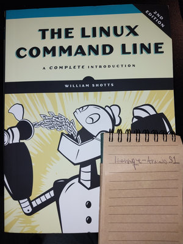

# The Linux Command Line, 2nd Edition: A Complete Introduction - William E. Shotts

## About this section 

I can't express enough how important this book is for anyone who wants to learn how to use the bash command line, not only programmers, but normal people who have interest in computers as well.

Unix is essentially the Latin of the computer languages nowadays, and Linux tries to carry its legacy to the best of its ability, hence learning how to use the command line in Linux is the closest you will get to learning Unix, which is exactly what this book does in the ultimate case.

## Instructions

Each file inside this folder consists of a bash source code file ('.sh') representing an entire chapter of the book. You can either save and run these files on your Linux machine (or Windows using Windows Subsystem for Linux), which will run the code as it is, but ideally you will read the commented sections and individually run the examples as they are shown. To do this, you need to open a terminal window (Ctrl+Alt+T) and type them on the go.

An important note if you do pretend to run it as a script; at some situations, pages like less may pop up, which will requires your input to keep the script running for its next steps. In order to do it, you may exit these pages pressing 'q' or 'ctrl d' or 'ctrl c' depending of the context.

Alternatively, you can read the book, which would be better.

## Chapters

### Part I - Learning the Shell
01 - [What is the Shell?](./01.sh)

02 - [Navigation](./02.sh)

03 - [Exploring the system](./03.sh)

04 - [Manipulating files and directories](./04.sh)

05 - [Working with Commands](./05.sh)

06 - [Redirection](./06.sh)

07 - [Seeing the world as the Shell sees it](./07.sh)

08 - [Advanced keyboard tricks](./08.sh)

09 - [Permissions](./09.sh)

10 - [Processes](./10.sh)

### Part II - Configuration and the Environment
11 - [The environment](./11.sh)

12 - [A gentle introduction to VI](./12.sh)

13 - [Customizing the Prompt](./13.sh)

### Part III - Common tasks and essential tools
14 - [Package management](./14.sh)

15 - [Storage Media](./15.sh)

16 - [Networking](./16.sh)

17 - [Searching for files](./17.sh)

18 - [Archiving and Backup](./18.sh)

19 - [Regular Expressions](./19.sh)

20 - [Text Processing](./20.sh)

21 - [Formatting Output](./21.sh)

22 - [Printing](./22.sh)

23 - [Compiling Programs](./23.sh)

### Part IV - Writing Shell Scripts
24 - [Writing your first Script](./24.sh)

25 - [Starting a Project](./25.sh)

26 - [Top-Down Design](./26.sh)

27 - [Flow Control: Branching with If](./27.sh)

28 - [Reading Keyboard input](./28.sh)

29 - [Flow Control: Looping with While/Until](./29.sh)

30 - [Troubleshooting](./30.sh)

31 - [Flow Control: Branching with Case](./31.sh)

32 - [Positional Parameters](./32.sh)

33 - [Flow Control: Looping with For](./33.sh)

34 - [Strings and Numbers](./34.sh)

35 - [Arrays](./35.sh)

36 - [Exotica](./36.sh)