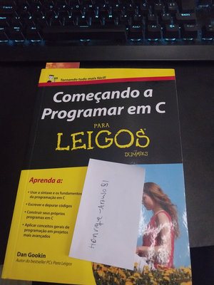

# C for Dummies - Dan Gookin

## About this section 

For this module, I will be using Dan Gookin's book "C for Dummies," which is full of introductory exercises.

Each file inside this folder will consist of a C source code file ('.c') that needs to be compiled in order to work.

## Instructions

If you are interested in testing any of them, I recommend OnlineGDB, an online compiler with support for the C language. Simply go to https://www.onlinegdb.com/ and select C in the Language option at the top right of the screen. Then, copy the code you are interested in checking, paste it into the compiler, and press "Run" (the green button in the middle of the screen). The result will be shown in a black shell environment at the bottom of the screen.

