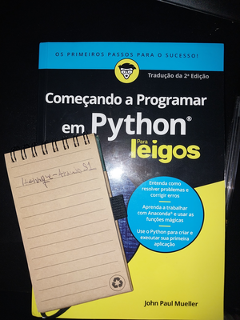

# Beginning Programming with Python for dummies - John Paul Mueller

## About this section 

For this module, I will be using John Paul Mueller's book, which is full of introductory exercises.

Each file inside this folder will consist of a python source code file ('.py'). Python is not a compiled language, so the code needs to be interpreted in order to run.

## Instructions

If you are interested in testing any of them, I recommend OnlineGDB, an online interpreter with support for the python language. Simply go to https://www.onlinegdb.com/ and select python 3 in the Language option at the top right of the screen. Then, copy the code you are interested in checking, paste it into the compiler, and press "Run" (the green button in the middle of the screen). The result will be shown in a black shell environment at the bottom of the screen.