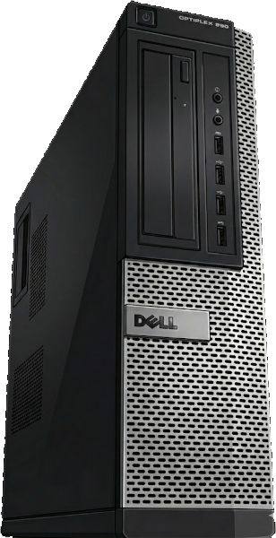
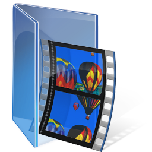

## Optiplex 990 - Uma geração de softwares

  
  
<em>Não esperem mais imagens, elas consomem muito espaço no github.</em>

---

# Introdução
O objetivo deste projeto é utilizar um antigo computador Dell Optiplex 990 para preservar softwares da era do windows xp e windows 7 que não são mais possíveis de serem utilizados em computadores recentes, mesmo através de emulação.

Talvez seja desnecessário dizer, isso foi feito com um uso pesado de inteligência artificial. Para essa tarefa, a IA é perfeita, pois trata-se de informações que apesar de obscuras para humanos, têm sido extensivamente discutidas ao passar das décadas, em fóruns de internet, que posteriormente foram usados para treinar esses modelos. 

Também foi necessário o uso de outras ferramentas populares, como o [The Internet Archive](https://archive.org), [Torrents](https://deluge-torrent.org/) e outros sites, que armazenavam as ferramentas, softwares e bibliotecas obsoletos, necessários para preservar e operar softwares deprecados.

No decorrer deste *Readme*, irei explicar melhor o contexto ao redor desse trabalho, detalhar minhas metas, o que fiz e como fiz para atingi-las.

---

# Dell Optiplex 990
Neste capítulo, será discutido os motivos que levaram à escolha do Dell Optiplex 990 para esse projeto.

## A brecha
Computadores muito antigos, como modelos populares dos anos 80, são simples o bastante para serem perfeitamente emulados até mesmo em aparelhos muito simples, como o raspberry pi. [Hobbystas](https://retropie.org.uk/) muitas vezes incluem imagens de emuladores com dezenas de milhares de softwares dessa época sem sequer avisar o público, isso porque a despeito do volume de programas, nessa época limitações de recursos implicavam que os softwares eram extremamente leves. Outros softwares mais antigos ainda, usados em universidades, são menores em volume, e caso ainda sejam importante, são mantidos vivos por essas insituições.

Existe, porém, um certo período de tempo, entre 1998 e 2014, em que houve uma explosão gigantesca do número de softwares, ocasionada pela popularização de computadores e da internet. Precisamente, dois sistemas operacionais são capazes de operar perfeitamente softwares feito durante essa época; o Windows XP 32 bits, e o Windows 7 64 bits. É possível que softwares daquele período funcionem em sistemas modernos (seja o windows atual ou mesmo utilizando [emuladores no linux](https://www.winehq.org/)), porém não é garantido. O motivo disso ocorrer, é que posterior a 2011, foram implementados padrões que garantem maior compatibilidade e estabilidade desses softwares. Programas feitos até esse momento (e até alguns anos depois, já que muitos programadores demoraram para se adaptar) não necessariamente seguiam tais regras, e sendo esse o caso, é muito provável que seus programas simplesmente pararam de funcionar. 

Windows XP e Windows 7 foram os sistemas operacionais mais importantes de uma época extremamente importante para o desenvolvimento da computação e da internet. Pode-se dizer sem erro, que a vasta maioria dos softwares mais importantes do planeta foram criados para esse sistema operacionais em específico, e muitos deles não funcionam mais por terem sido abandonados e não seguirem padrões pós 2011. Windows XP em particular, tem um bônus de possuir softwares proprietários que emulavam programas mais antigos, da época do windows 98.

Existe uma situação, então, na qual programas de computadores feitos até 1998 são facilmente emulados até mesmo por brinquedos, e programas feito após 2014 funcionam em qualquer computador atual por seguirem padrões rígidos de abstrações. A *Brecha* se encontra nesse período entre 1998 e 2014, que por coincidência, é onde um número gigantesco de programas criados por pessoas de todos os tipo ao redor do planeta foram criados, vendidos e usados. Uma grande quantidade desses softwares pode ser considerado, para todos os efeitos, <abbr title="Mídia que se acredita existir, mas que não está disponível ao público."><em>Lost Media</em></abbr>.

## Lost Media

A destruição ou perda de obras de arte, textos literários e outros trabalhos artísticos não é novidade na história. Porém, em nossa era, existe uma camada extra nesse tema, que se refere à perda de trabalhos artísticos feitos em formatos digitais, como vídeos, programas de computadores, animes e jogos eletrônicos. 

[Lost Media](https://en.wikipedia.org/wiki/Lost_media) é um termo recente que têm se tornado comum para pessoas que acessam a internet. <abbr title="Para mais detalhes, confira ''Lost Media'' no youtube"><em>Constantemente se vê o público discutindo sobre algum episódio de um programa de TV aberta que aconteceu algumas décadas atrás e que nunca mais se teve registro nenhum.</em> Eventualmente quando alguém encontra uma cópia do programa e traz ela para uma plataforma como o youtube, ela deixa de ser considerada *Lost Media*.

O exemplo mais dramático disso nos últimos anos foi o ataque ao Estúdio [*Kyoto Animation*](https://en.wikipedia.org/wiki/Kyoto_Animation_arson_attack), onde um incêndio criminoso causou 36 mortes, 33 feridos. Na ocasião, a sala de servidores do estúdio não foi afetada, porém isso serviu de alerta para o esforço de preservação. Nos últimos anos, têm havido no Japão um grande movimento, envolvendo inclusive figuras políticas, para preservar a vasta quantidade de produção cultural feita ao longo de décadas. Se trata de uma quantidade gigantesca de shows de tv, filmes, jogos e animes, em vários tipos de formatos, muitos dos quais em formatos obsoletos e condições precárias.

Logicamente, para pessoas comuns, não é possível montar um laboratório de alta tecnologia onde o processo de converter rolos de filmes antigos e fitas magnéticas em dados binários legíveis para sistemas operacionais modernos. Porém Lost Media não se trata apenas de dados que estão fisicamente inacessíveis. Se os programas estão disponíveis, porém não funcionam em sistemas operacionais atuais, eles ainda permanecem inacessíveis, e portanto, *perdidos*.

## O Optiplex 990

Supondo que você queira jogar um vídeo game antigo; o primeiro passo seria tentar instalar ele no seu sistema operacional atual. Se for windows, você irá clicar duas vezes no exe e ver o que acontece. No linux, você irá usar um programa de compatibilidade, como wine. O jogo não funciona em nenhum dos dois; depende de alguma biblioteca ou configuração antiga que não chegou aos nossos tempos. Em outras palavras, trata-se de um software que só estaria funcional em um sistema operacional antigo, como o windows xp. A partir daí, a opção evidente é *emular* o sistema original do programa em seu hardware atual, através de uma *Virtual Machine*. Emulação é algo recorrente no momento atual; existe uma grande comunidade de hobbistas e entusiastas que conseguem criar emuladores extremamente potentes para consoles de vídeo games que não existem mais, a ponto de que realmente não há nenhuma latência, stutter ou bugs quando você tenta rodar o jogo em sua máquina. Esse esforço comunitário em nível global é impressionante, porém não parece funcionar para algo tão complexo como um sistema operacional fechado, como é o caso do windows xp e windows 7. Virtual Machines para esses sistemas operacionais existem, e funcionam, porém elas não são perfeitas; se você quisesse fazer uma tarefa simples, como editar um texto em uma versão particularmente antiga do word, isso seria fácil. Mas no caso hipotético de rodar um jogo antigo, isso se torna inviável, pois haverá delay, screen tearing, o refresh rate da tela é sofrível, e outros bugs poderão surgir. Para todos os efeitos, um jogo que só funciona em uma versão específica do windows são *Lost Media* a menso que você use, fisicamente, um computador exclusivo com o sistema operacional que aquele software necessita.

Fazendo a comparação, novamente, com um emulador de um console antigo; imagine que estamos 10 anos no passado, quando o console PS2 já não estava a venda, porém o emulador mais avançado da época ainda estava engatinhando; tentar jogar um exclusivo PS2 era impossível naquele cenário. Você iria precisar comprar um PS2 usado para tanto. Atualmente, [PCX2](https://pcsx2.net/) trata-se de um emulador extremamente robusto, que funciona até mesmo em dispositivos androids, o que remove essa barreira. 

O leigo talvez seja levado a pensar que, para resolver o embróglio de acessar softwares antigos, bastaria comprar um computador barato de nossa época, instalar o sistema operacional da época e realizar a emulação. Porém isso não é possível quando falamos do Windows XP e do Windows 7; tratam-se de sistemas proprietários, que utilizavam tecnologias antigas que se tornaram obsoletas conforme os anos passaram. Isso significa que, ao tentar instalar qualquer desses sistemas em um computador novo, o usuário sequer conseguirá passar da tela de boot, já que o instalador do sistema operacional não irá reconhecer as tecnologias e modos de booting atuais. 

É necessário, então, utilizar um computador da época em que esses sistemas ainda estavam em uso. Mas qual?

Machado de assis escreve, em Memórias Póstumas de Brás Cubas, que a versão final do ser humano, a mais completa, é dada aos vermes, porque a evolução constante acaba quando a morte chega. Tirando essa lógica mórbida do contexto humano, e levando ela para o mundo da computação, isso implica que o melhor hardware possível para emular softwares de uma era passada, é um computador que surgiu no final daquela época, sendo, evidentemente, o hardware mais avançado que jamais será criado para tais sistemas.

*Para esse projeto, foi escolhido o Desktop Dell Optiplex 990 DT, pois, lançado em 2011, foi um computador extremamente popular, com amplo suporte, e um dos últimos a ter suporte para Windows XP.*

Lembrando o cronograma de eventos até o momento;
+ Windows XP surgiu em 2001, foi deprecado em 2009, porém recebeu suporte até 2014;
+ Windows 7 surgiu em 2009, foi deprecado em 2015, porém recebeu suporte até 2020;
+ Optiplex 990 surgiu em 2011, numa época de transição, em que o suporte ao Windows xp ainda era necessário, e no apogeu do  Windows 7.

É seguro dizer que o Optiplex é perfeito para essa tarefa, pois representa o melhor hardware feito para aquela época, enquanto oferece suporte total para esses sistemas operacionais. No ano de 2026, o hardware continua sendo bastante robusto até mesmo para sistemas operacionais atuais, porém o ponto de maior interesse não se trata meramente de poder computacional bruto, e sim da relação hardware/software, que foi aprimorada por uma geração inteira de programadores empresariais ao redor do planeta. 

## Anexos

O objetivo e a escolha do hardware base resolvem o núcleo do problema, porém para a aplicação do projeto, outras ferramentas são necessárias, tanto de software, quando de hardware. Tratam-se dos próprios sistemas operacionais, de drivers, programas antigos e esquecidos mantidos por hobbistas, configurações obscuras de 20 anos atrás, e, logicamente, da estrela do projeto; os softwares a serem resgatados do esquecimento. Do lado de hardware, discutirei informações importantes como a configuração escolhida para operar o computador, detalhes de configuração da bios e pequenos entraves e decisões que surgiram no caminho.

No decorrer dos capítulos, irei detalhar o caminho a se percorrer para ter acesso a todos esses recursos.

---

# Capítulo 1 - Abstração Zero
Abstração, no contexto de programação, é um termo empregado para separar uma ideia (nível de abstração máximo), de sua aplicação física dentro dos circuítos integrados de computador (abstração mínima). Porém, em computação, o número zero também é muito usado no contexto de "infinito"; quando um programa pede um valor numérico para repetição de uma determinada tarefa, zero pode vir a tomar o lugar de um valor infinito.

## Uma Supernova vista de [FarFarOut](https://en.wikipedia.org/wiki/2018_AG37)

Computadores são usados por humanos [há bastante tempo](https://en.wikipedia.org/wiki/Abacus), e mesmo computadores da forma como o conhecemos hoje, já tem uma longa [história](https://en.wikipedia.org/wiki/A_Symbolic_Analysis_of_Relay_and_Switching_Circuits), outras infraestruturas relacionadas, como a [internet](https://en.wikipedia.org/wiki/DARPA), estão sendo usadas para fins militares, igualmente por várias gerações, e claramente envolveram uma quantidade gigantesca de trabalho, de um exército de pesquisadores e desenvolvedores ao longo das décadas. Porém até muito recentemente, todo esse trabalho estava inacessível ao público em geral. A população, claro, era afetada pelo desenvolvimento das tecnologias, de uma maneira ou de outra, mas não podia interargir com ela, já que a complexidade, a falta de escalonamento, os altos custos, e, naturalmente, o sigilo militar, colocavam as pessoas comuns como um público espectador que tinha acesso a algumas benesses desses avanços, mas sem ter contato com ele.

Computadores pessoais se tornaram baratos o suficiente a partir da década de 80. Porém ainda eram raros e não possuiam acesso a internet. Já naquela época houve uma explosão na criação de softwares, que hoje podem ser baixados em poucos segundos; devido a limitação de recursos daqueles aparelhos, mesmo dezenas de milhares de jogos e softwares caberiam em um microsd barato com muita folga.

O evento crítico começou em meados dos anos 90; os computadores se tornaram potentes e complexos o suficiente para que programas elaborados pudessem ser criados, a indústria do cinema começou a usar extensivamente [Computer-generated imagery](https://en.wikipedia.org/wiki/Computer-generated_imagery), em filmes que rapidamente cativavam o público, como Toy Story e Titanic, e mais importante; a internet começava a ser disponibilizada para pessoas comuns.

Após várias gerações de desenvolvimento acelerado, a tecnologia computacional explodia em algo que pode ser descrito como uma [Supernova](https://en.wikipedia.org/wiki/Supernova), particularmente em países de primeiro mundo, como Japão e Estados Unidos, onde um grande número de pessoas possuia recursos para estar na vanguarda desse evento.

Registros culturais que cristalizam essa época são raros, mas existem. Em 1998, a obra [Serial Experiments Lain](https://en.wikipedia.org/wiki/Serial_Experiments_Lain) é lançada. Ironicamente, até hoje muitas pessoas reclamam que *parecem* não entender do que se trata, sendo que esse era justamente o núcleo da narrativa; a internet era algo novo, revolucionário, estranho, incompreensível. De certa forma, continua sendo até hoje.

Sobre a internet em si, naquela época, pouquíssimos registros ainda permanecem; apesar da função *printscreen* já existir há muito tempo, no meio de todas aquelas inovações, registrar uma captura de tela faria tanto sentido quanto fotografar uma pedra num evento histórico importante. Um dos poucos registros que se tem notícia foi feito no filme *Deep Impact (1998)*, onde uma jornalista utiliza um buscador primitivo de internet sobre uma garota chamada [ELE](https://en.wikipedia.org/wiki/Extinction_event#In_media) que estaria tendo um caso com um político importante, e acaba caindo em uma página do [Departamento de Paleontolgia de Berkley](https://ucmp.berkeley.edu/); ELE na verdade era uma sigla referente a eventos de extinção em massa, no caso, um meteoro.

Houve um período de tempo em que a internet era recheada de páginas longas de instuitições educacionais explicando eventos históricos ou debatendo em detalhes tópicos de todos os tipos. A rolagem de página parecia ser infinita nos pequenos monitores crt, e apesar das limitações técnicas, o conteúdo carregava rapidamente, pois as poucas imagens disponíveis eram extremamente pequenas.

[Mundos virtuais inteiros surgiram para quem estava no lugar e nas condições certas](https://www.youtube.com/watch?v=8naR1EUSduo), e em 1998 seria seguro dizer, foi o momento que essa supernova atingiu praticamente todos os habitantes do primeiro mundo, não se tratando mais de um privilégio, mas de uma tecnologia popularizada que estava chegando ao alcance do público em geral.

Em 1998, eu tinha apenas 6 anos, e morava num dos locais mais isolados do planeta em termos de tecnologia. Mesmo naquela época, porém, eu tinha acesso a computadores; computadores obsoletos dos anos 80 doados a minha escola, ou computadores mais modernos de parentes, que apesar de não ter internet, já possuiam jogos 3d da época. Em 2003, as ondas de choque da Supernova finalmente iriam me atingir; naquele ano, meu pai adquiriu um computador com acesso à internet discada; com alguns anos de atraso, eu sentiria o calor da explosão, mesmo que vista de uma grande distância do centro.

Era difícil para mim, naquela época, entender como algo tão conveniente poderia ser dado de graça. Ainda se vendia enciclopédias enormes, por preços absurdos, e elas não possuiam tanta interatividade e tanto conteúdo quanto a internet, mesmo que naquela época a internet brasileira fosse minúscula. Jogos de computadores já eram vendidos em [*CDRoms*](https://digerati.vinizinho.net/) junto com revistas a preços exorbitantes (em especial para crianças), e foi um grande avanço quando eu finalmente aprendi a descompactar arquivos em formatos zip.

---

# Capítulo 2 - A Missão do Rei - Máscara da Eternidade

*CDRoms* com softwares estavam a venda, mas eram extremamente caros. Rapidamente se criou uma cultura em que se emprestava o cd, era feito uma cópia e ambas as pessoas possuiam o software. As cópias eram feitas por lojas, e mais tarde, conforme o público foi adquirindo melhor hardware, em seus próprios computadores, com leitores capazes de ler e escrever discos. Logicamente as empresas correram atrás de medidas anti pirataria, que eram  contornadas por softwares mais sofisticados, em uma corrida de gato e rato. Creio que [Nero](https://en.wikipedia.org/wiki/Nero_Burning_ROM) foi o ápice dessa época.

Dessa época ainda me restam dúzias, talvez centenas de *CDRoms*, muitos originais e outros meras cópias. Surpreendentemente eles continuam funcionando até hoje, prova da resiliência dessa tecnologia.

Infelizmente a grande maioria dos jogos eram em inglês, idioma alienígena no Brasil até hoje. Porém haviam algumas exceções; estúdios de dublagem corajosos faziam um trabalho muito interessante em títulos de jogos famosos. Um exemplo disso, foi um dos jogos que eu peguei emprestado na época, legendado em português, foi [*King Quest VIII - Mask of Eternity*](https://en.wikipedia.org/wiki/King%27s_Quest:_Mask_of_Eternity). Não há nada de particularmente especial nesse jogo; eu já revisitei vários títulos da minha infância diversas vezes, como *Carmagedoom*, *Dino Crisis*, *Caesar III*, *Half Life* e *Pandemonium* (tenho memórias muito boas desse último, pois joguei com meus irmãos pouco antes deles irem embora em definitivo da casa dos meus pais). A diferença desse jogo para os demais é que ele simplesmente não funciona em sistemas operacionais modernos. 

Começava uma Missão para rodar King Quest VIII. Tentar emular esse software, e outros que teimam em não funcionar, foi o que me motivou a aprender a usar *Virtual Machines*, porém eu rapidamente eu me dei conta de que isso não valia a pena; *VM's* são úteis para tarefas que não exigem um ambiente gráfico complexo, como abrir um programa legado de contabilidade. Para um jogo, é uma experiência inviável. 

---

# Capítulo 3 - Saltos Lógicos

A emulação de um sistema operacional de código fechado não é uma tarefa trivial. Então logicamente, a ideia seria não emular o SO, e sim rodá-lo em um computador. Porém há detalhes suscintos nessa tarefa; por exemplo, computadores MultiCore, que hoje são o padrão, se tornaram comuns em 2006, jogos muito antigos, como é o caso de King Quest VIII (lançado em 1998), não foram otimizados para essa tecnologia e sofrem frequentemente de bugs. Se você adiciona a essa camada um hardware que esta a 20 anos de distância do software em questão, as chances do programa funcionar caem drásticamente. Por outro lado, se fosse tentado usar um hardware do ano em que o software foi lançado, pela lei de moore o resultado também ficaria ruim, já que computadores dobram de capacidade a cada 18 meses e um computador mais antigo terá menos recursos. 

Então o ideal seria conseguir um hardware obsoleto para os padrões atuais, mas que foi o apogeu daquela era. Quem me ajudou com essa escolha foi o Gemini. Inteligências Artificiais, no ano de 2026, não são muito boas em dar recomendações, porém tópicos envolvendo programação e computadores são uma pequena exceção à regra, já que a internet, desde seu surgimento, esta repleta de discussões sobre o tema, e essas discussões foram usadas para alimentar o treinamento dos modelos. Segundo o Gemini, o Optiplex 990 DT foi um dos últimos computadores feitos para ser compatível Windows XP, e possuia um processador particularmente parrudo para a época, portanto era a escolha natural.

A tarefa, então, já possuia três núcleos centrais; 
- Windows XP: além de ser um dos sistemas operacionais mais importantes, ainda retia compatibilidade excelente com sistemas feitos nos anos 90;
- Windows 7: também muito usado, e feito em uma era em que ainda não havia padronização o suficiente para que os softwares criados para ele fossem facilmente portados para diferentes sistemas operacionais;
- Optiplex 990: o hardware com suporte nativo para ambos os sistemas, e recursos para que eles operassem em capacidade máxima.

A partir desse núcleo, detalhes menores de design para cumprir com a tarefa iriam surgir.

---

# Capítulo 3 - Os Galhos 

Comprar o computador foi fácil e relativamente barato; é um modelo empresarial muito usado ao redor do mundo. Porém isso era apenas o começo da tarefa. Após a chegada do computador, começava o trabalho real. Ele exigiria tanto adaptações de hardware quanto de software, que são difíceis de ver para quem não tem muita experiência com o assunto.

## 3.1 - Hardware
O Dell Optiplex é um computador empresarial feito aos milhões, com um nível de padronização e ergonomia muito alto. Alguns detalhes importantes que irão fazer sentido mais adiante são o que se segue; o computador possui exatamente uma Baía 5.25 com um leitor de CD's, e a placa mãe possui exatamente 3 entradas satas, sendo que uma delas é de baixa velocidade para o leitor de CD's. A configuração padrão da BIOS é em modo RAIDOn, que nada tem com o sistema de backup Raid 1; computador sai de fábrica com apenas um HDD. O chamado Caddy proprietário da Dell dentro do gabinete só tem espaço para esse HDD de 3.5", e suporte para um HDD ou SSD 2.5". Levando em conta que o computador é de 2011, quando os SSD's estavam começando a surgir, a ideia seria de que caso o dono quisesse, poderia adquirir um pequeno (e com custo exorbitante) SSD Sata, conectar ele ao computador e usar uma tecnologia proprietária da intel para fazer com que o SSD fosse usado como uma espécie de cache que tornaria o computador mais responsivo.

O primeiro problema que eu tive foi o Caddy proprietário do computador; parece que o antigo dono não viu necessidade de manter ele, já que instalou um SSD e deixou ele solto dentro do computador. Tive que desembolsar mais algum dinheiro para adquirir um caddy feito para esse tipo de modelo de computador.

O segundo problema foi a bateria morta do CMOS. Na verdade isso foi simples de resolver, e me fez ver algo que eu provavelmente deixaria passar batido; toda vez que o a placa mãe fica sem energia, ela volta aos padrões de fábrica. Isso não seria problema nos dias de hoje, porém para sistemas antigos, era algo letal; modificar as configurações de BIOS do computador para qualquer coisa além das configurações bases criava uma bomba relógio, pois no momento em que a bateria morrer (e ela acaba a cada poucos anos), eu seria recebido pela famosa tela azul da morte.

O teceiro problema, é que eu tenho apenas um computador, e quero usar dois sistemas operacionais. Acho que a maioria das pessoas iria escolher fazer um dual boot, porém isso traz outro problema; windows 7 funciona perfeitamente bem com um SSD, mas Windows XP surgiu e morreu numa era em que essa tecnologia não existia. Para essa situação, eu já tenho uma técnica que consiste em substituir a entrada 5.25" de CDs por um Adaptador Orico, que permite colocar e retirar HDD's e SSD's com facilidade do computador. A desvantagem dessa estratégia, é que, como já disse anteriormente, eu tenho uma vasta coleção de CD's, e retirar um leitor de CD's acaba retirando um pouco o ponto do projeto. Porém isso pode ser contornado com a compra de um Leitor de CD's USB.

O motivo de eu ter adquirido um novo Caddy para HDD, mesmo usando a baía frontal para inserir e retirar rapidamente os dois sistemas operacionais, é que a quantidade de softwares daquela época é gigantesca, demandando um meio de armazenamento dedicado. A ideia é que o HDD instalado dentro do computador não possua nenhum SO, apenas sirva para guardar softwares que ficam, então, disponíveis para o sistema operacional em funcionamento.

Por fim, a peça final do quebra cabeça é a GPU. Novamente o Gemini me guiou na escolha; segundo foi me explicado, havia um diamante bruto que me serviria muito bem; Pny Nvidia Quadro K620 seria uma das últimas placas de vídeo feitas com suporte ao Windows XP, e ainda sim uma excelente placa de vídeo para o Windows 7. O preço desse hardware foi extremamente alto. Da maneira que eu entendi, existe alta demanda para algo do tipo, pois muitas máquinas industriais ainda operam Windows XP e as peças de reposição ficam cada vez mais raras. Após encomendar a K620, encontrei no galpão da minha casa uma antiga placa de vídeo G210, que também era velha o suficiente para ter drivers para o Windows XP. O gemini me recomendou usar ela até o momento da chegada da K620 para evitar que o computador ativasse drivers de vídeo da intel que poderiam vir a causar conflitos mais tarde. Aparentemente trocar uma placa nvidia por outra nvidia seria muito mais simples.

## 3.2 - Software
Curiosamente, a questão de software foi muito mais simples na atualidade do que era na época em que esses sistemas ainda eram populares. Com a ajuda da inteligência artificial, fica mais fácil encontrar exatamente o que eu preciso. Além disso, naquela época era comum um certo nível de mercenarismo de empresas de softwares, que tentavam cobrar por qualquer produto, por mais simples que fosse, ou, se ofereciam um serviço gratuíto, costumavam colocar softwares invasivos no meio, fora outras estratégias, como liberar um software ruim de graça e cobrar pelo produto completo, ou dar o produto completo por um tempo limitado. Como esses sistemas operacionais estão mortos, isso sumiu. O que restou foram ferramentas que estão disponíveis gratuitamente na internet e mantidas por entusiastas. O bem da verdade, é que eu não tenho sentido mais a pressão para comprar softwares, ou usados softwares freemiums desde que migrei para linux. Talvez isso ainda seja comum para usuários de sistemas operacionais pagos no presente, ou talvez essa era já tenha passado.

Sobre esse assunto, eu sou partidário da opinião que não há sentido em cobrar por softwares em si. Por se tratarem de algo que pode ser copiados de forma infinita, pela regra da demanda e da procura, seu custo sempre será zero. Isso não quer dizer, obviamente, que programadores não mereçam ser pagos, apenas que eles não podem cobrar *especificamente* por um bloco de códigos que não tem custo para ser replicado. Empresas ao redor do mundo já se deram conta disso, e tem diferentes abordagens sobre o tópico. Algumas tentam estratégias sujas, como forçar o funcionamento do software a sempre passar por um servidor controlado por eles. Outros não vendem exatamente o software, e sim uma forma de acesso fácil, prática e irrestrita a um software que constantemente sofre atualizações, geralmente por preços que podem ser pagos pelo público em geral. Até mesmo estratégias como deliberadamente distribuir versões disfuncionais do software para prejudicar o usuário final podem ser usadas. A discussão sobre propriedade intelectual é vastíssima, porém se tornou algo claro no mundo da tecnologia, que a forma com que a empresa defende a posse do software não é judicializada, ao menos no que tange relações de desiguais, como uma empresa vs um indivíduo. Como último ponto sobre o tema, é interessante notar, nos primórdios da computação parece que o plano era tornar o software algo indisponível para o usuário final atráves de tecnicas de obfuscamento, como criar um código fonte que estaria apenas em mãos do programador, enquanto o comprador teria acesso apenas a uma versão compilada do produto; talvez a ideia fosse causar escassez de forma artificial através de uma série de métodos diferentes, porém nenhum deles foi aplicado com sucesso por muito tempo.

O software mais importante era justamente o sistema operacional. Dois sistemas operacionais, no caso; Windows 7 e Windows XP. Um detalhe importante é que devido ao fato de serem Sistemas Operacionais que não sofrem atualizações, não é possível utilizar eles conectados à internet hoje em dia. Não sem antes configurar o firewall de maneira que bloqueie qualquer conexão que não seja expressamente permitida. A verdade é que para o projeto em questão, a internet é algo desnecessário, portanto o computador não estará conectado em momento algum a Web.

A primeira coisa importante sobre o sistema operacional é em que tipo de local ele será armazenado. Windows 7 já era capaz de rodar de forma nativa em SSD's, portanto foi escolhido um SSD Sata para servir como moradia para esse sistema. Windows XP, no entando, predatava essa tecnologia, ele não possui o algoritmo *TRIM* para fazer uso otimizado de SSD's. Algumas tecnicas podem ser usadas para combinar o Windows XP com um SSD; a mais obvia é chamada de *superprovisionamento*, onde cerca de 20% do espaço do SSD é deixado sem particionamento, de forma que apesar do Sistema Operacional não ser capaz de fazer o uso do TRIM, o controlador do SSD possa fazer o serviço de otimização sozinho. Isso preserva a principal vantagem do SSD, que seria a velocidade, porém mantém algumas desvantagens, como o uso intensivo de leitura e escrita. O que pesou mais, no entanto, é o preço explosivo até mesmo de SSD's de entrada. Portanto para o Windows XP, foi escolhido praticamente a mesma coisa que teria sido escolhida 20 anos atrás; um HDD mecânico SATA de 160GBs. Não ficaria surpreso se o próprio HDD em questão tenha 20 anos de idade.

Escolhido o meio em que o SO irá ser instalado, é preciso da ISO, que é uma imagem do programa operacional em si. Isso foi supreendentemente fácil de encontrar. O próprio Gemini me recomendou o site [www.archive.org ](https://archive.org/) para a tarefa. Esse é o primeiro contato oficial do Archive com o projeto, mas é importante notar que a existência desse tipo de repositório é até mais importante do que adquirir hardwares obsoletos, pois sem esse tipo de recurso, *Lost Media* é literalmente impossível de ser recuperada.

A Dell fez uma imagem customizada do Windows XP para computadores como o Optiplex. Isso foi importante, pois configurações de Bios tendem a ser temperamentais até mesmo com sistemas operacionais modernos. Com um computador tão proeminente, a existência de uma Iso especializada reduziria o número de problemas que eu teria. Para windows 7, não foi necessário uma ISO em específico. 

O *meio* de instalação é onde eu perdi bastante tempo. No ano de 2026, uma ferramenta que se tornou relativamente comum para instaladores de sistemas operacionais é um software chamado *Ventoy*. Trata-se de algo prático, porém um tanto quanto polêmico por alguns motivos. Eu poderia fazer um passo a passo de como foi a instalação, mas devido ao fato de eu ter tido problemas, não recomendo seu uso para o projeto em questão. Sendo sincero, o Ventoy foi prático para instalar o Windows 7, mas não para o Windows XP. Até eu me dar de conta que o problema era o software ventoy em si, que não era otimizado para um sistema operacional tão antigo, tive de eliminar dúzias de outros suspeitos, como configurações da bios, entrada de vídeo, configurações do próprio ventoy, entrada usb, etc. A inteligência artificial falhou em me ser útil nessa situação. Por essas e outras razões, o meio que eu recomendo para ser feita a instalação de Windows XP é [WinSetupfromUSB](https://www.winsetupfromusb.com/). 

O processo de de instalação será detalhado em outro capítulo.

Após escolhido o meio, a isntalação é feita e... tanto o Windows XP quanto o Windows 7 surgem completamente pelados. Isso porque antigamente, instalar drivers era um processo manual, inclusive se utilizavam CD's com o software de periféricos. Isso, eu bem me lembro, era um processo extremamente frustrante; mesmo que você soubesse da teoria, a aplicação prática era uma batalha tentando encontrar drivers obscuros em sites de spam. Mesmo naquela época, porém, surgiram tentativas de criar repositórios de drivers que fariam o trabalho de instalação de forma automática. Um programa muito popular naquele tempo era Snappy Driver Installer. Infelizmente, eu também lembro que essa ferramenta se tornou popular devido a sua utilidade, e em um certo momento seus desenvolvedores tiveram de "se vender" as práticas sujas da época. Se não me engano, a decadência começou quando o instalador do software jogava junto consigo programas inúteis como o [Mcaffee](https://en.wikipedia.org/wiki/McAfee_Antivirus) ou o Opera Browser. Por incrível que pareça, porém, uma versão útil dessa ferramenta foi cristalizada no tempo para as futuras gerações; trata-se do que é conhecido agora como [Snappy Drivers Installer Origins](https://snappy-driver-installer.org/). É possível usar uma versão enxuta do programa, que busca os drivers de forma online, porém para o propósito do projeto, seria necessário usar a versão offline, que pesa incríveis 53GB's. Trata-se de uma lista taxativa de praticamente todos os drivers já feitos para ambos os sistemas operacionais. Nada que as velocidades de internet e acesso a torrents não tornem facilmente acessíveis. 

Sobre o Snappy Drivers, eu tenho certeza de que há uma história interessante por trás de sua criação e evolução até os dias atuais. 

Drivers de periféricos, como placas de vídeo, som, etc. são softwares básico para que o hardware funcione adequadamente. Porém também há outro tipo de software que não vem, necessariamente, atrelado com o sistema operacional; tratam-se de uma infinidade biblioteca, de recursos, addons, DLL's e outros softwares obscuros que eram pré requisitos para vários tipos de programas diferentes. De momento, é possível classificar esse tipo de recurso em três listas distintas;
+ Codecs de vídeos;
+ Pacotes proprietários da Microsoft; 
+ Dependências obscuras que eu terei de correr atrás quando algum programa [particularmente teimoso](https://en.wikipedia.org/wiki/King%27s_Quest:_Mask_of_Eternity) falhar em rodar.

Num ambiente ideal, após a instalação Hardware, do Sistema Operacional, dos drivers e dos softwares e dependências, finalmente a *Lost Media* poderia ser trazida de volta a vida. 

---

# Capítulo 4 - Boneyard

[Boneyards](https://en.wikipedia.org/wiki/Aircraft_graveyard) são locais onde aviões descomissionados são enviados para serem armazenados para retirada de peças. O processo de adquirir materiais para a jornada envolveu algo similar. Computadores antigos são vendidos a preços baixos na internet, peças antigas podem ser encontradas em galpões ou compradas novamente pela internet. Algumas coisas são fáceis e baratas de achar, outras são muito difíceis e o preço acompanha a escassez. 

A peça principal foi adquirida por cerca de R$600 reais. Trata-se do próprio Optiplex.

Porém, o computador veio com um ssd solto dentro de sua estrutura, sem o caddy, que precisou ser adquirido por outros R$60 reais. Essa peça de plástico simples era indispensável, pois apesar de SSD's não sofrerem desgaste mecânico devido a choques, o mesmo não se aplica a discos rígidos convencionais. E eu precisaria instalar pelo menos um HDD convencional dentro do gabinete, para servir de repositório compartilhado dos programas mais tarde.

Para fazer a troca rápida de sistemas operacionais, foi adquirido, também, o Adaptador Orico 1106ss, por cerca de 170 reais. Ele ocupa o espçao do leitor de CD's. Futuramente eu pretendo adquirir um leitor de CDs por USB, a fim de ter acesso a minha antiga coleção de CDRoms.

Por fim, uma peça importante é a GPU. Em uma discussão com o gemini, chegou-se à conclusão que a melhor placa de vídeo para o que eu tinha em mente seria uma Nvidia Quadro K620 de 2GB de RAM. Isso porque, além de ser uma placa corporativa amplamente usada, ela também foi um dos últimos modelos fabricados com drivers para o Windows XP, portanto seria uma placa de qualidade razoável para o windows 7, e literalmetne o ápice do que seria possível encontrar para o Windows XP. Parece que muitas outras pessoas já haviam chegado à mesma conclusão; o preço dessa placa é salgado. O mais barato que eu encontrei foi R$ 400 reais. Enquanto a placa estava em uma longa jornada pelos correios, encontrei em um galpão uma antiga placa de video Nvidia G210 com 1GB de RAM. Havia duas razões para eu me adiantar e usar a placa de vídeo mais fraca; a primeira é que manter os drivers de vídeo integrados da intel desativados desde a instalação do SO iria evitar qualquer conflito, e a segunda é que o Optiplex, por si só, não possui a entrada HDMI que a GPU oferece.

Cabos, HDD's e SSD's eu já possuia em mãos, o que me foi útil, pois o preço desses dispositivos explodiu recentemente, devido a corrida pela inteligência artificial. Se você esta lendo isso em algum momento do futuro, espero que se lembre disso como uma memória distante.

Por fim, também foi necessário uma bateria CMOS de R$ 6 reais para substiuir a bateria velha que veio com o PC.

Talvez eu poderia adicionar um cadeado à lista. Parece que havia uma preocupação grande com o furto de peças desses PCs corporativos, já que eles vinham com uma entrada para cadeados, e literalmente um sensor que servia para avisar se a tampa havia sido aberta.

Essas são todas as peças velhas que eu precisava para o projeto. Todo o resto não custaria dinheiro, e sim tempo e suor.

---

# Capítulo 5 - Brute Force

Conseguir as imagens dos Sistemas Operacionais foi fácil. Elas estavam rapidamente disponíveis no Internet Archive. Inclusive, para o Windows XP, havia uma versão customizada da Dell que foi feita para o Optiplex. Uma coisa que eu aprendi com o Gemini, é que para o Windows XP, era uma ideia muito ruim utilizar uma iso de 64 bits; apesar de Windows XP 64 bits existir, essa versão foi algo experimental que veio com uma série de desvantagens e poucas vantagens; a forte retrocompatibilidade que o SO possuia com versões anteriores do Windows desapareceu, e o suporte para ele foi muito incipiente devido à baixa popularidade. Apesar do Windows XP 32 bits possuir vários problemas, como o fato de só permitir 4GB de ram (somando tanto o ram primário quanto o ram da GPU), e de só conseguir ler partições de no máximo algo em torno de 2TB, tais limitações fazem parte da inerente da experiência desse sistema operacional. 

O meio de instalação escolhido, foi, inicialmente, um software indie que se tornou bastante popular recentemente. Trata-se do Ventoy. Existe certa controvérsia ao redor desse projeto, porém o Gemini me garantiu que as chances dele ser um programa de espionagem de um país estrangeiro são relativamente baixas (apesar de não serem nulas). Eu calculei que mesmo que fosse o caso, isso não faria diferença pelo simples fato de que o computador não estará conectado à internet. Existe uma chance maior que zero disso não ser totalmente verdade, mas não vem ao caso comentar sobre isso no momento.

O motivo do Ventoy ter se tornado popular é a sua praticidade; basicamente você formata um flashdrive com esse software, e simplesmente joga isos de diferentes sistemas operacionais dentro da partição do flashdrive. Mais tarde, ao bootar um computador com o ventoy, uma interface gráfica simples oferece a possibilidade de instalar os diferentes sistemas operacionais que estão no flashdrive.

Foi simples instalar Windows 7 em um SSD. Porém isso foi feito antes da Baía 5.25 Orico vir, e no momento que que eu instalei a nova peça de hardware, o simples ato de remover o leitor de CD e mudar a entrada SATA do sistema operacional causou uma tela azul da morte (BSOD). Então me lembrei (ou aprendi) algo que era padrão Microsoft até recentemente; basicamente a maneira com que a empresa via computadores naquela época, era de que o usuário não iria modificar o hardware sem a ajuda de especialistas, de maneira que até algo simples como mudar a entrada SATA do disco que possuia o Sistema Operacional iria causar problemas. Lição aprendida e Windows 7 reinstalado.

E então eu notei que a bateria CMOS estava morta. Por sorte, tenho uma balança por perto que doou a bateria à causa (nos dias seguintes eu comprei uma bateria nova para a balança quando fui no mercado). A morte da bateria causou novamente problemas de tela azul da morte. O mecanismo por trás é muito simples; no momento em que eu instalei o Windows 7, modifiquei algumas configurações internas da BIOS, que se mantiveram dentro da placa mãe enquanto ela estava ligada à tomada. Uma leve queda de energia sem a bateria é o que basta para resetar as configurações para o padrão de fábrica. Isso me fez perceber que, daqui alguns anos, quando a bateria morrer de novo, eu posso vir a ser saudado por algo do tipo e não me lembrar do motivo. A maneira mais fácil de contornar esse problema é deixar as configurações de fábrica como padrão de instalação em ambos os Sistemas Operacionais; o pior que pode acontecer é o relógio estar errado. Após essas considerações, re-instalei o Windows 7 novamente.

O Windows 7 foi instalado de forma bem sucedida em um SSD de 120gb.

Era a vez de instalar o Windows XP. Foi aí que aquelas frustrações antigas retornaram; fiquei sendo recebido por constantes telas azuis da morte todas as vezes que tentava instalar o Sistema Operacional. Não havia muitos indícios do que poderia estar causando isso, e a Inteligência Artificial tem suas limitações. Só havia uma coisa possível a ser feita neste cenário; explorar todas as possibilidades disponíveis. E esse processo tomou cerca de uma tarde inteira. Depois de algo em torno de algumas dúzias de tentativas, por eliminação, a única conclusão disponível era de que o Ventoy, que havia instalado o Windows 7 sem problemas, não possuia cacife para um sistema operacional como o Windows XP.

Como resultado, o programa utilizado para instalar o Windows XP foi [WinSetupFromUSB](https://www.winsetupfromusb.com/). Há alguns detalhes técnicos obscuros, como o fato da instalação requerer duas etapas. Creio que seja mais prático deixar um vídeo tutorial do que explicar em texto.

O Windows XP foi instalado de forma bem sucedida em um HDD de 160gb.

---

# Capítulo 6 - O Apêndice

Além da Baía 5.25 onde seria possível fazer uma troca física dos discos com os sistemas operacionais, também seria necessário um HDD interno dentro do computador, para guardar softwares compartilhados entre ambos os sistemas. Um baú, por assim dizer. Após a chegada do Caddy proprietário da Dell para o Optiplex, foi possível realizar a instalação de um HDD 3,5" com 2TB de espaço, dentro do gabinete.

Infelizmente, um detalhe importante me escapou logo de cara; em que pese o HDD, com uma ampla variedade de softwares, estivesse em formato NTFS e tenha sido reconhecido imediatamente pelo Windows 7, o mesmo não ocorreu com o Windows XP. Isso porque ele não estava formatado em MBR, que era o formato da época do Windows XP 32bits. Curiosamente, o tamanho máximo permitido para partições MBR era algo em torno de 2TB. 

A instalação de Drivers foi feita rapidamente no Windows 7. O arquivo de 53.4GB do [Snappy Drivers Installer Origins](https://snappy-driver-installer.org/) instalado via Torrent resolveu em questão de minutos uma tarefa que demoraria horas em algum momento aproximadamente 20 anos atrás. Logo após isso vieram alguns programas básicos, como codecs de vídeo, leitor de PDF, emulador de CD's e desempacotador de zips.