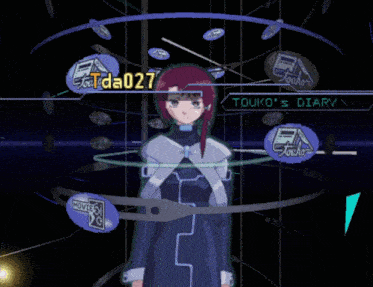

# Serial Experiments X

## Sobre este diretório

A maior parte deste repositório foca em estudos práticos e voltados ao mercado de trabalho. No entanto, esta seção é dedicada ao desenvolvimento de projetos pessoais e experimentais. Muitos destes projetos abordam tópicos de nicho, onde a documentação é escassa (esparsa). O avanço da inteligência artificial facilitou a execução destas ideias, fornecendo um vasto suplemento de informações, desde que filtradas com critério para mitigar alucinações ou imprecisões geradas pelos modelos.

O objetivo é documentar o progresso destes projetos ao longo do tempo, independentemente da conclusão ou do escopo de interesse geral. A intenção é compartilhar o conhecimento técnico adquirido durante a implementação, que possa ser útil a outros desenvolvedores.

Este é um esforço contínuo e sem prazo determinado. As atualizações ocorrerão conforme o progresso dos projetos. Devido às limitações de armazenamento do GitHub, o uso de imagens será otimizado e restrito ao essencial.

## Referência cultural

<table>
  <tr>
    <td valign="top">
      
A obra <i>Serial Experiments Lain</i> captura com maestria o caos e a estranheza que a internet emergente provocou nos anos 90. Concebido como um ambicioso projeto transmídia, seu nome reflete sua natureza: uma série de trabalhos experimentais que incluíam um anime — a peça mais conhecida —, um mangá e um jogo para PlayStation.

      
Lançado em 1998, o jogo é descrito como uma "simulação de rede" que aprofunda o universo da série. Nele, o jogador assume um papel investigativo, navegando por fragmentos de sessões de terapia e entradas de diário para desvendar a complexa história de Lain. Diferente do anime, a experiência é notavelmente mais introspectiva e fragmentada, focando na exploração da psique da personagem.

      
Talvez eu tenha tempo de jogar isso em algum momento do futuro. Mesmo assim, entendo que é uma boa referência para essa parte do meu repositório. Para quem tiver interesse (e mais tempo), um fã traduziu o jogo do japonês e o incluiu diretamente na web. O jogo pode ser acessado <a href="https://3d.laingame.net/#/">aqui</a> e o repositório do projeto, <a href="https://github.com/ad044/lainTSX">aqui</a>.

    </td>
    <td width="20"></td> <!-- Espaçador -->
    <td align="right" valign="top">
      
    </td>
  </tr>
</table>