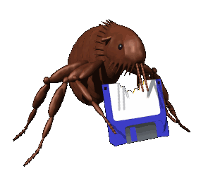
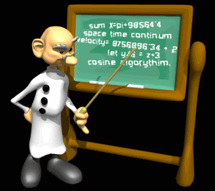
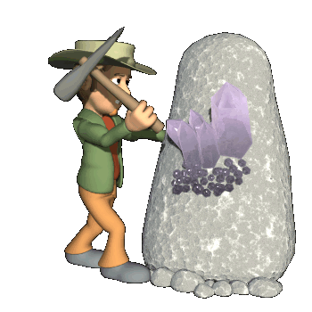

# Third-Party Assets and Credits

Este projeto utiliza recursos visuais e bibliotecas de terceiros, cujos direitos e atribuições estão detalhados abaixo:

### Imagens e Animações

---

  
  
<em>Animation. Animation. Animation Factory, Authentic Creatives, LLC, 04-03-2020, https://animationfactory.com/download.php?iid=35404&tl=animations. Accessed 17-04-2026.</em>

---

  
  
<em>Dimensional Computer Bug Clipart. Clipart. Animation Factory, Authentic Creatives, LLC, 18-04-2020, https://animationfactory.com/download.php?iid=7306&tl=3dclipart. Accessed 27-04-2026.</em>

---

  
  
<em>Computer Wizard Clipart. Clipart. Animation Factory, Authentic Creatives, LLC, 18-04-2020, https://animationfactory.com/download.php?iid=9959&tl=3dclipart. Accessed 27-04-2026.</em>

---

  
  
<em>Clipart. Clipart. Animation Factory, Authentic Creatives, LLC, 18-04-2020, https://animationfactory.com/download.php?iid=10488&tl=3dclipart. Accessed 11-05-2026.</em>

---

  
  
<em>Gem Clipart. Clipart. Animation Factory, Authentic Creatives, LLC, 18-04-2020, https://animationfactory.com/download.php?iid=10473&tl=3dclipart. Accessed 11-05-2026.</em>

---